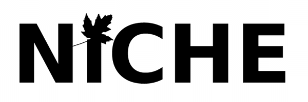

There is no correct or preferred order to the lessons listed here; they
are grouped into themes, which are listed in alphabetical order. We
invite you to browse around. If you can’t find a skill, technology, or
tool covered here, please let us know!

Application Programming Interfaces (APIs)
-----------------------------------------

APIs let you programmatically request specific information from a
website. Learn how to use them.

-   [Intro to the Zotero API](../lessons/intro-to-the-zotero-api) 
 Amanda Morton

-   [Creating New Items in Zotero](../lessons/creating-new-items-in-zotero) 
Amanda Morton

-   [Counting Frequencies from Zotero Items](../lessons/counting-frequencies-from-zotero-items) 
Spencer Roberts

Data Management
---------------

You put a lot of effort into your research. Make sure that effort lasts
by adopting sustainable strategies to your code, your data, and your
research processes. A little bit of planning can save you a lot of time.

-   [Preserving Research Data](../lessons/preserving-your-research-data) 
James Baker

-   [Sustainable Authorship in Plain Text using Pandoc and Markdown](../lessons/sustainable-authorship-in-plain-text-using-pandoc-and-markdown) 
Dennis Tenen and Grant Wythoff

Data Manipulation
-----------------

Just like it sounds, learn how to use programming to change, move,
clean, or count data. These are essential techniques for preparing data
to be used in various tools.

-   [Cleaning Data with OpenRefine](../lessons/cleaning-data-with-openrefine) 
 Seth van Hooland, Ruben Verborgh, Max De Wilde

-   [Normalizing Data](../lessons/normalizing-data) 
 William J. Turkel & Adam Crymble

-   [Counting Frequency](../lessons/counting-frequencies) 
 William J.  Turkel & Adam Crymble

-   [Understanding Regular Expressions](../lessons/understanding-regular-expressions) 
Doug Knox

-   [Cleaning OCR’d Text with Regular Expressions](../lessons/cleaning-ocrd-text-with-regular-expressions) 
Laura Turner O’Hara

-   [Transliterating non-ASCII Characters with Python](../lessons/transliterating) 
 Seth Bernstein

Mapping and GIS
---------------

Mapping can be an effective way to visualize and interpret historical
data. These lessons introduce historical geographic information systems
(GIS) using open source software.

-   [Intro to Google Maps and Google Earth](../lessons/googlemaps-googleearth) 
 Jim Clifford, Josh MacFadyen, Daniel Macfarlane

-   [Installing QGIS 2.0 and Adding Layers](../lessons/qgis-layers) 
 Jim Clifford, Josh MacFadyen, Daniel Macfarlane

-   [Creating New Vector Layers in QGIS 2.0](../lessons/vector-layers-qgis) 
 Jim Clifford, Josh MacFadyen, Daniel Macfarlane

-   [Georeferencing in QGIS 2.0](../lessons/georeferencing-qgis) 
 Jim Clifford, Josh MacFadyen, Daniel Macfarlane

Omeka Exhibit Building
----------------------

Learn how to present historical materials online.

-   [Up and Running with Omeka.net](../lessons/up-and-running-with-omeka) 
Miriam Posner
-   [Creating an Omeka.net Exhibit](../lessons/creating-an-omeka-exhibit) 
Miriam Posner

Python Programming Basics
-------------------------

Some introductory lessons for basic techniques in Python. If you’re new
to programming in python, you’ll first need to set up a programming
environment. For the most flexibility, we recommend that you follow
these instructions on [setting up python on the command
line](http://cli.learncodethehardway.org/book/).

As an alternative to using the command line, many text editors are able to run
python code within the editor. Some older python tutorials listed here
reference one of these tools, called Komodo Edit. You can install this for
[Mac](../lessons/mac-installation), [Linux](../lessons/linux-installation), or [Windows](../lessons/windows-installation).

-   [Installing Python Modules](../lessons/installing-python-modules-pip) 
Fred Gibbs, Ben Hurwitz, Amanda Morton

-   [Code Reuse and Modularity](../lessons/code-reuse-and-modularity) 
William J. Turkel & Adam Crymble

-   [Manipulating Strings in Python](../lessons/manipulating-strings-in-python) 
 William J. Turkel & Adam Crymble

-   [Working with Text Files](../lessons/working-with-text-files) 
 William J. Turkel & Adam Crymble

-   [Viewing HTML Files](../lessons/viewing-html-files) 
 William J. Turkel & Adam Crymble

Topic Modeling
--------------

A topic modeling tool takes a single text (or corpus)  and looks for
patterns in the use of words; it is an attempt to inject semantic
meaning into vocabulary. It can help you to very quickly find ‘topics’
in a large corpus of texts.

-   [Getting Started with Topic Modeling and MALLET](../lessons/topic-modeling-and-mallet) 
 Shawn Graham, Scott Weingart, & Ian Milligan

Web Scraping
------------

Learn how to use programming to download material from the Internet in a
controlled, semi-automated manner.

-   [Datamining the Internet Archive Collection](../lessons/data-mining-the-internet-archive) 
 Caleb McDaniel

-   [Automated Downloading with Wget](../lessons/automated-downloading-with-wget) 
 Ian Milligan

-   [Applied Archival Downloading with Wget](../lessons/applied-archival-downloading-with-wget) 
 Kellen Kurschinski

-   [Intro to Beautiful Soup](../lessons/intro-to-beautiful-soup) 
 Jeri Wieringa

-   [Working with Web Pages](../lessons/working-with-web-pages) 
 William J. Turkel & Adam Crymble

-   [From HTML to a List of Words (part 1)](../lessons/from-html-to-list-of-words-1) 
 William J. Turkel & Adam Crymble

-   [From HTML to a List of Words (part 2)](../lessons/from-html-to-list-of-words-2) 
 William J. Turkel & Adam Crymble

-   [Downloading Multiple Records Using Query Strings](../lessons/downloading-multiple-records-using-query-strings) 
 Adam Crymble

*The Programming Historian* released under the
[CC-BY](http://creativecommons.org/licenses/by/2.0/)  license.

[ 
](http://niche-canada.org/) 
[ 
](http://chnm.gmu.edu)

